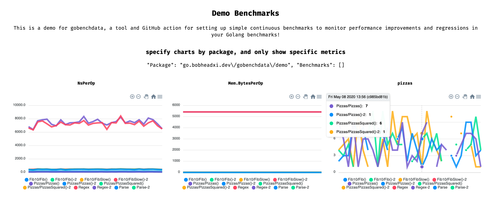

# 📉 gobenchdata

[](https://dev.azure.com/bobheadxi/bobheadxi/_build/latest?definitionId=7&branchName=master)
[](https://github.com/marketplace/actions/gobenchdata-to-gh-pages)
[](https://godoc.org/go.bobheadxi.dev/gobenchdata)
[](https://gobenchdata.bobheadxi.dev/)

a tool for inspecting `go test -bench` data, and a
[GitHub Action](https://github.com/features/actions) for continuous benchmarking.

<a href="https://gobenchdata.bobheadxi.dev/" target="_blank">
  
</a>

* [GitHub Action](#github-action)
  * [Setup](#setup)
  * [Configuration](#configuration)
  * [Visualisation](#visualisation)
* [`gobenchdata` CLI](#gobenchdata-cli)
* [Development and Contributions](#development-and-contributions)

<br />

## GitHub Action

A GitHub Action for uploading Go benchmark data to `gh-pages` using `gobenchdata`.

### Setup

For example, in `main.workflow`:

```hcl
workflow "Benchmark" {
  on = "push"
  resolves = ["gobenchdata to gh-pages"]
}

action "filter" {
  uses = "actions/bin/filter@master"
  args = "branch master"
}

action "gobenchdata to gh-pages" {
  uses = "bobheadxi/gobenchdata@master"
  needs = ["filter"]
  secrets = ["GITHUB_TOKEN"]
  env = {
    PRUNE_COUNT = "20"
  }
}
```

Learn more about GitHub Actions in the [official documentation](https://github.com/features/actions).

### Configuration

| Variable             | Default                   | Purpose
| -------------------- | ------------------------- | -------
| `GITHUB_TOKEN`       | set by GitHub             | token to provide access to repository
| `GITHUB_ACTOR`       | set by GitHub             | the user to make commits as
| `GIT_COMMIT_MESSAGE` | `"add new benchmark run"` | the commit message for the benchmark update
| `GO_BENCHMARKS`      | `.`                       | benchmarks to run (argument for `-bench`)
| `GO_BENCHMARK_FLAGS` |                           | additional flags for `go test`
| `GO_BENCHMARK_PKGS`  | `./...`                   | packages to test (argument for `go test`)
| `FINAL_OUTPUT`       | `benchmarks.json`         | destination path of benchmark data
| `PRUNE_COUNT`        | `0`                       | number of past runs to keep (`0` keeps everything)

### Visualisation

The `gobenchdata` GitHub action eventually generates a JSON file with past benchmarks.
You can visualize these continuous benchmarks by creating a web app that reads
from the JSON benchmarks file, or by using `gobenchdata-web`:

```
go get -u go.bobheadxi.dev/gobenchdata/x/gobenchdata-web
git checkout gh-pages
gobenchdata-web --title "my benchmarks" # generates a web app in your working directory
```

You test the web app locally using a tool like [serve](https://www.npmjs.com/package/serve):

```
serve .
```

This feature is a work in progress. An example site published by this repository is
available at [gobenchdata.bobheaxi.dev](https://gobenchdata.bobheadxi.dev/).

## `gobenchdata` CLI

`gobenchdata`, which the GitHub Action leverages to manage benchmark data,
is also available as a CLI:

```
go get -u go.bobheadxi.dev/gobenchdata
gobenchdata help
```

Usage documentation can be found in the
[godocs](https://godoc.org/go.bobheadxi.dev/gobenchdata).

## Development and Contributions

Please report bugs and requests in the [repository issues](https://go.bobheadxi.dev/gobenchdata)!

See [CONTRIBUTING.md](./CONTRIBUTING.md) for more detailed development documentation.
